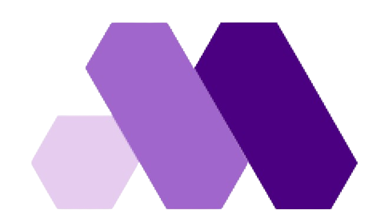

#  PDI
Projeto acadêmico com <a href="https://youtan.com.br" target="_blank"> Youtan </a>.

 
 

 
 

## Objetivo 🎯
Este programa foi desenvolvido para otimizar o processo de criação e gestão de planos de desenvolvimento individual (PDIs). Ele oferece uma solução centralizada para líderes que buscam estruturar, monitorar e alcançar metas de crescimento de forma eficiente, promovendo uma cultura de melhoria contínua e desenvolvimento de competências.

 
 

## Tecnologias utilizadas 💻

 

  &nbsp;&nbsp;&nbsp;&nbsp;
  &nbsp;&nbsp;&nbsp;&nbsp;&nbsp;
  &nbsp;&nbsp;&nbsp;&nbsp;&nbsp;
  &nbsp;&nbsp;&nbsp;&nbsp;&nbsp;
  

 

## Equipe Scrum 👥

 

Nome | Função | Contato | GitHub
-|-|-|-
Ramon Varjão | Scrum Master | |
Kauan Domingues | Product Owner | |
Breno Reis | Developer | |
Cauã Mehiel | Developer | |
Davi Andrade | Developer | |
Gabriel Borges | Developer | |
Jessica Katayama | Developer | |
João Paulo | Developer | |
Nicolas Anderson | Developer | |

